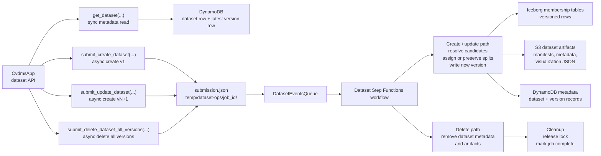

# Dataset Operations Overview

This document describes the dataset functionality available through the CVDMS programmatic API.

The core dataset operations are:

* `get_dataset(...)`
* `submit_create_dataset(...)`
* `submit_update_dataset(...)`
* `submit_delete_dataset_all_versions(...)`

Datasets are built from canonical imagery and labels already registered in the platform. A dataset is not edited in place. Instead, create and update operations produce immutable dataset versions with their own membership rows, manifest artifacts, metadata, and version records.

## Practical Walkthrough

For an example of using the dataset API from Python, see:

[`sample_walkthrough_datasets.ipynb`](sample_walkthrough_datasets.ipynb)

The notebook walks through common dataset operations, including creating a dataset, checking dataset metadata, updating a dataset, and deleting a dataset.

## Programmatic API Entry Point

Dataset operations are exposed through `CvdmsApp`:

```python
from cvdms_platform import CvdmsApp

app = CvdmsApp(
    app_name="<app-name>",
    profile_name="<aws-profile-name>",
)
```

The app resolves deployed infrastructure resources from SSM parameters. The user only needs the deployed app name and an AWS profile with access to the CVDMS resources.

## Dataset Operation Model

Dataset operations fall into two categories:

### Synchronous read

`get_dataset(...)` is a synchronous metadata lookup. It reads from DynamoDB and returns the latest known dataset state and latest version metadata.

### Asynchronous submissions

Create, update, and delete operations are asynchronous submissions.

These methods submit a job and return a `job_id`:

```python
{"submission_status": "success", "job_id": "<job-id>"}
```

The submitted workflow then runs server-side through the Dataset Stack.

Each dataset submission writes:

```text
s3://<file-bucket>/temp/dataset-ops/<job_id>/submission.json
```

Dataset operations use a global workflow lock so only one dataset operation runs at a time. The lock holder is also used as the `job_id`.

### Dataset Operation Summary



## High-Level Architecture

Dataset state is stored across three layers.

### 1. Iceberg Membership Tables

Dataset membership rows are stored in task-specific Iceberg tables. Membership is partitioned by `dataset_id` and `version`.

There are five membership shapes:

* **single-label**
  * `dataset_id`
  * `version`
  * `image_id`
  * `label`
  * `split`

* **multi-label**
  * `dataset_id`
  * `version`
  * `image_id`
  * `labels`
  * `split`

* **object-detection**
  * `dataset_id`
  * `version`
  * `image_id`
  * `bbox_annotation_ids`
  * `classes_present`
  * `split`

* **semantic-segmentation**
  * `dataset_id`
  * `version`
  * `image_id`
  * `semantic_mask_ids`
  * `classes_present`
  * `split`

* **instance-segmentation**
  * `dataset_id`
  * `version`
  * `image_id`
  * `instance_annotation_ids`
  * `classes_present`
  * `split`

For structured task types, `classes_present` stores the dataset-version-specific allowed-class subset represented by that membership row, not necessarily the full raw class set present in the canonical artifact.

### 2. DynamoDB Metadata

Two DynamoDB tables track dataset metadata:

* a dataset table containing dataset-level state and the latest-version pointer
* a dataset versions table containing one immutable row per dataset version

The version table is the main provenance ledger. It stores version number, operation, split behavior, selection config, counts, artifact URIs, and related metadata.

### 3. S3 Version Artifacts

Each dataset version writes a version-specific artifact bundle to S3.

Artifacts include:

* selection SQL
* selection config JSON
* train/val/test/all manifests
* enriched membership CSV
* metadata JSON
* visualization artifacts for dataset inspection

## Core Dataset Model

A dataset is defined by:

* a stable `dataset_id`
* an immutable `label_type`
* dataset-wide `allowed_classes`
* an `honor_source_splits` setting
* a version history
* membership rows for each version
* split assignments for each version
* S3 artifacts and DynamoDB metadata for each version

A dataset version is produced by one of:

* initial `create`
* update `add`
* update `remove`

The latest dataset state is represented by the latest version, not by mutating a single stored dataset definition in place.

## Supported Label Types

The dataset system supports five task types:

* `single-label`
* `multi-label`
* `object-detection`
* `semantic-segmentation`
* `instance-segmentation`

These differ in how candidates are selected, how membership rows are stored, and how overlapping rows are handled during updates.

## Dataset ID Rules

`dataset_id` values must:

* be strings
* be at most 128 characters
* contain only lowercase letters, digits, and hyphens
* start and end with a lowercase letter or digit
* not contain consecutive hyphens

The API normalizes the dataset id by stripping whitespace and converting to lowercase before validation.

## Selection Config

Create and update operations use a `selection_config` to specify which canonical imagery and labels should be considered.

### Required Key

* `allowed_classes`

### Optional Keys

* `allowed_sources`
* `upload_date_range`
* `width_range`
* `height_range`
* `lighting_buckets`
* `blur_buckets`
* `contrast_buckets`
* `color_buckets`

Unsupported keys are rejected.

### `allowed_classes`

Required. A non-empty list of class names.

Class names are canonicalized using the same class-normalization rules used elsewhere in CVDMS. Duplicate classes after canonicalization are rejected.

Dataset selection is always class-scoped.

### `allowed_sources`

Optional. A non-empty list of source names.

Source names are canonicalized using the same source-normalization rules used by the upload flow. Duplicate sources after canonicalization are rejected.

### `upload_date_range`

Optional 2-element list of ISO date strings:

```python
["YYYY-MM-DD", "YYYY-MM-DD"]
```

The start date must be less than or equal to the end date.

### `width_range` and `height_range`

Optional 2-element integer ranges:

```python
[min_value, max_value]
```

Both values must be integers greater than or equal to `1`.

### Image Quality Buckets

Optional bucket filters:

* `lighting_buckets`: `night`, `low_light`, `normal`, `bright`, `glare`
* `blur_buckets`: `sharp`, `mild_blur`, `blurry`
* `contrast_buckets`: `low`, `medium`, `high`
* `color_buckets`: `low`, `medium`, `high`

These filters operate on canonical image profiling fields and are useful for building datasets with controlled visual characteristics.

## Source Split Handling

Dataset creation supports two split modes:

1. derive splits using a split strategy
2. honor source splits uploaded with the imagery

This is controlled by:

```python
honor_source_splits: bool
```

When `honor_source_splits=False`, CVDMS assigns splits using the requested split strategy, currently `stratified_v1`.

When `honor_source_splits=True`, CVDMS uses source split values from `image_source_membership.source_split`.

In this mode:

* `split_strategy_name` is still required by the public create API, but is ignored by the server-side workflow.
* images with no resolved non-empty source split are excluded
* images with conflicting non-empty source splits are excluded
* updates cannot use `split_approach="rebalance"`
* retained rows keep their existing split
* newly added rows are assigned from source split metadata

This mode is useful when the upstream dataset already has official train/validation/test splits.

To use this mode, source split information should be provided during upload through the upload API’s `source_split` argument.

## `create_dataset(...)`

### Purpose

Creates a new dataset at version `1`.

### API

```python
app.submit_create_dataset(
    dataset_id="<dataset-id>",
    label_type="<label-type>",
    description="<description-or-none>",
    selection_config={...},
    split_strategy_name="stratified_v1",
    honor_source_splits=False,
)
```

### Arguments

* `dataset_id`: globally unique dataset identifier
* `label_type`: one of the five supported task types
* `description`: optional description, up to 500 characters
* `selection_config`: selection rules used to resolve candidate imagery
* `split_strategy_name`: currently `stratified_v1`
* `honor_source_splits`: whether to use uploaded source splits instead of derived splits

### What Happens During Create

1. Inputs are validated.
2. The API checks that the dataset does not already exist.
3. A dataset operation job is submitted to S3.
4. The Dataset Stack workflow creates version `1`.
5. Candidate imagery and labels are resolved from the canonical catalog.
6. Splits are assigned.
7. Membership rows are written to Iceberg.
8. S3 artifacts are written.
9. DynamoDB dataset and dataset-version metadata are written.
10. Visualization artifacts are generated.

### Candidate Resolution by Task Type

#### Single-Label

Only images that resolve to exactly one distinct allowed class are retained.

Example:

* raw labels on image: `["cat", "feline"]`
* `allowed_classes = ["cat", "dog"]`

After filtering to allowed classes, only `cat` remains, so the image is a valid single-label candidate.

The resulting candidate row contains:

* `label`
* `classes_present = [label]`

#### Multi-Label

Any image with at least one allowed string label is retained.

The resulting row contains:

* `labels`: deduped allowed labels
* `classes_present`: same deduped allowed labels

#### Object Detection / Semantic Segmentation / Instance Segmentation

Any image whose linked structured label artifacts contain at least one allowed class is retained.

The resulting row contains:

* the appropriate structured label id array
* `classes_present` normalized to the allowed-class subset only

For structured tasks, label ids are not trimmed or rewritten during dataset creation. The qualifying canonical label ids are preserved, and `classes_present` records the dataset-relevant subset. Downstream export or training-prep code can decide how to trim or transform label content for a particular model format.

## `get_dataset(...)`

### Purpose

Returns the latest dataset information for a given dataset id.

### API

```python
app.get_dataset(dataset_id="<dataset-id>")
```

If the dataset does not exist, the result is:

```python
{
    "dataset_info": {"exists": False},
    "latest_version_info": None,
}
```

If the dataset exists, the result contains:

```python
{
    "dataset_info": {...},
    "latest_version_info": {...},
}
```

### What It Reads

This call is intentionally DynamoDB-only.

It reads:

1. the dataset row from the dataset table
2. the latest version row from the dataset versions table

It does not query Iceberg or S3 directly.

### Dataset Info Fields

The `dataset_info` object includes:

* `exists`
* `dataset_id`
* `latest_version`
* `label_type`
* `allowed_classes`
* `honor_source_splits`
* `created_at`
* `created_by`
* `last_modified_by`
* `dataset_description`

### Latest Version Info Fields

The `latest_version_info` object includes:

* `version`
* `created_at`
* `description`
* `operation`
* `split_approach`
* `split_strategy_name`
* `honor_source_splits`
* `effective_split_mode`
* `total_image_count`
* `total_train_count`
* `total_val_count`
* `total_test_count`
* `version_s3_prefix`
* `selection_sql_uri`
* `selection_config_uri`
* `metadata_json_uri`
* `membership_enriched_csv_uri`
* `manifest_uris`
* `selection_config`

This gives callers the latest dataset definition, provenance, counts, and artifact pointers without directly querying the storage layer.

## `update_dataset(...)`

### Purpose

Creates a new dataset version by applying an `add` or `remove` operation to the latest existing version.

This does not overwrite the old version.

### API

```python
app.submit_update_dataset(
    dataset_id="<dataset-id>",
    operation="add",
    selection_config={...},
    split_approach="maintain",
    split_strategy_name=None,
    description=None,
)
```

### Arguments

* `dataset_id`: target dataset
* `operation`: `add` or `remove`
* `selection_config`: selected imagery to add or remove
* `split_approach`: `maintain` or `rebalance`
* `split_strategy_name`: required only when `split_approach="rebalance"`
* `description`: optional version description

### Validation Rules

Update validation enforces:

* the dataset must already exist
* `operation` must be `add` or `remove`
* `split_approach` must be `maintain` or `rebalance`
* `rebalance` requires `split_strategy_name`
* `maintain` must not provide `split_strategy_name`
* update `allowed_classes` must be a subset of the dataset-wide `allowed_classes`

To add new classes, create a new dataset.

If the dataset was created with `honor_source_splits=True`, update operations may not use `rebalance`.

### High-Level Update Flow

1. Inputs are validated.
2. The API loads the current dataset state.
3. The API validates update invariants.
4. A dataset operation job is submitted to S3.
5. The Dataset Stack workflow creates a new version.
6. Selected imagery rows are resolved.
7. Current membership rows are loaded.
8. Next-version rows are computed.
9. Membership rows are written to Iceberg.
10. New version artifacts are written to S3.
11. DynamoDB metadata is advanced to the new version.
12. Visualization artifacts are generated.

## Update Semantics

Update operations are applied at the `image_id` level.

### `operation="add"`

The next version starts from the current version and includes all selected images.

If selected images overlap existing dataset images, behavior depends on task type.

### `operation="remove"`

The next version removes any current membership row whose `image_id` appears in the selected imagery set.

## `maintain` vs `rebalance`

### `maintain`

Preserves existing split assignments for rows that remain in the dataset.

This means:

* retained rows keep their existing split
* enriched overlap rows keep their existing split
* only truly new rows receive split assignments

For `honor_source_splits=True` datasets, newly added rows receive splits from source split metadata.

### `rebalance`

Recomputes splits for the entire next-version image universe.

This includes:

* retained rows
* enriched overlap rows
* new rows

`rebalance` is useful when the dataset composition changes enough that split balance should be recalculated globally.

`rebalance` is not allowed for datasets created with `honor_source_splits=True`.

## Overlap Behavior on `add`

When selected imagery includes an `image_id` already present in the current dataset version, behavior depends on task type.

### Single-Label

Current row wins.

The selected row is ignored for overlap purposes because one image can only contribute one effective scalar label in a single-label dataset.

### Multi-Label

Labels are enriched.

The final row merges current labels with selected labels:

* union current `labels` and selected `labels`
* dedupe
* preserve the image in the dataset
* keep the existing split in `maintain`
* rebalance the merged row in `rebalance`

### Object Detection / Semantic Segmentation / Instance Segmentation

Structured label ids are enriched.

The final row merges current task-specific ids with selected task-specific ids:

* union current id array with selected id array
* union current `classes_present` with selected `classes_present`
* dedupe both
* preserve the image in the dataset
* keep the existing split in `maintain`
* rebalance the merged row in `rebalance`

The downstream training-prep/export layer is responsible for interpreting those arrays for a particular model format.

## `delete_dataset_all_versions(...)`

### Purpose

Submits a request to delete a dataset and all of its versions.

### API

```python
app.submit_delete_dataset_all_versions(
    dataset_id="<dataset-id>",
)
```

### Behavior

The delete operation:

1. validates the dataset id
2. verifies the dataset exists
3. submits a `delete_dataset` task
4. deletes dataset metadata and artifacts through the Dataset Stack workflow

This operation is intended to remove the dataset as a whole, not only the latest version.

## Split Strategy: `stratified_v1`

The current split strategy is a deterministic greedy stratified splitter.

### Input Expectations

Each candidate row must include:

* `image_id`
* `dataset_label_type`
* `classes_present`

It also benefits from:

* `sha256_hash`
* `data_source`
* `lighting_bucket`
* `blur_bucket`
* `contrast_bucket`
* `color_bucket`

The splitter preserves all existing row fields and adds `split`.

### Primary Goals

The splitter attempts to:

1. keep duplicate-content groups together
2. preserve class proportions across splits
3. roughly preserve target split sizes
4. secondarily balance source and image-condition buckets

### Leakage Awareness

Rows are grouped by:

* `sha256_hash` when available
* otherwise `image_id`

This keeps duplicate-content images in the same split when possible.

### Split Ratios

The current fixed target ratios are:

* `train = 0.70`
* `val = 0.15`
* `test = 0.15`

### Determinism

The splitter is deterministic. Given the same candidate rows, it produces the same split assignments.

## Artifact Model

Each dataset version produces a versioned artifact bundle in S3.

### Selection SQL

The SQL artifact stored for a version means:

* for version `1`: the original full dataset-selection SQL
* for later versions: the diff SQL that selected imagery to add or remove for that version

The system does not recompute a monolithic “full current dataset SQL” for every update version. Version history is represented as:

* initial full definition at v1
* a sequence of changes for v2, v3, ...

### Selection Config

The version’s selection config is stored as JSON.

### Manifest Files

Each version writes canonical task-aware manifests for:

* `all`
* `train`
* `val`
* `test`

These manifests are used by downstream training projects.

### Enriched CSV

A CSV view of the final split rows is stored for profile, debugging, and inspection.

### Metadata JSON

The metadata JSON summarizes split counts, distributions, class mappings, and artifact pointers.

### Visualization Artifacts

For create and update operations, the dataset workflow writes visualization artifacts used by the local Streamlit visualization tool.

These artifacts summarize dataset composition by split, class distribution, image-quality buckets, and other inspection fields so a dataset version can be reviewed before training.

## DDB Provenance Model

Dataset version history is recorded in DynamoDB.

For each version, DynamoDB stores fields such as:

* version number
* operation
* split approach
* split strategy name
* honor-source-splits mode
* effective split mode
* version description
* selection config
* creator
* split counts
* total image count
* artifact URIs

The authoritative provenance for dataset evolution lives in the version table, while S3 stores the larger artifacts.

## How a Dataset Evolves Over Time

### Version 1

Created by `submit_create_dataset(...)`.

This version establishes:

* dataset id
* immutable label type
* dataset-wide allowed classes
* source-split behavior
* original selection SQL
* original split behavior
* original membership rows
* original artifacts
* original version metadata

### Versions 2+

Created by `submit_update_dataset(...)`.

Each new version stores:

* update operation: `add` or `remove`
* split approach: `maintain` or `rebalance`
* diff selection config
* diff selection SQL
* final materialized membership rows for that version
* final artifacts for that version
* final version metadata

The latest dataset state is the latest materialized version.

## Practical Guidance

### Use `create_dataset(...)` when

* defining a dataset for the first time
* creating the first version of a project-specific dataset
* starting from a new class set
* switching between derived splits and source-split-preserving behavior

### Use `update_dataset(..., operation="add")` when

* adding newly eligible images
* enriching multi-label memberships
* enriching structured-task memberships
* expanding within the dataset’s existing allowed class set

### Use `update_dataset(..., operation="remove")` when

* removing a problematic subset
* removing a source
* removing a date range
* removing images from selected quality buckets

### Use `maintain` when

* you want minimal disruption to existing splits
* you are adding a modest number of new images
* you are enriching labels on existing images
* you are removing a subset without reshuffling retained rows
* the dataset uses `honor_source_splits=True`

### Use `rebalance` when

* class composition changed significantly
* source mix changed significantly
* image-condition distribution changed significantly
* you want the entire latest version to reflect a recalculated split balance

Do not use `rebalance` for source-split-preserving datasets.

## Summary

The dataset API supports:

* retrieving latest dataset metadata
* creating versioned datasets
* updating datasets through add/remove operations
* deleting a dataset and all versions

The system is built around these principles:

* datasets are versioned, not mutated in place
* canonical imagery and labels are the source of truth
* each version materializes its own membership rows and artifacts
* split behavior is explicit and reproducible
* source splits can be preserved for datasets with official upstream splits
* provenance is stored in DynamoDB
* artifacts are stored in S3
* membership is stored in Iceberg