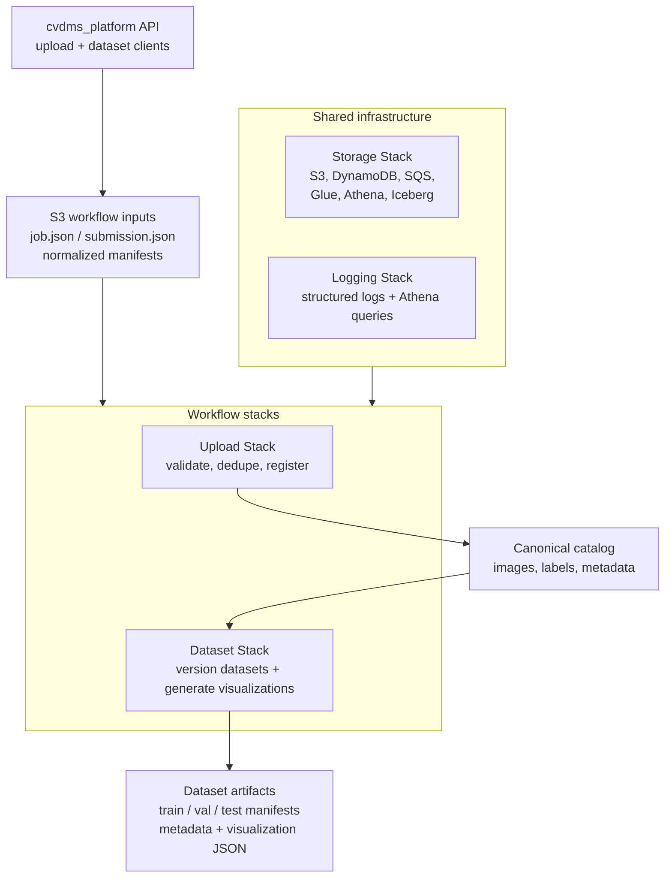
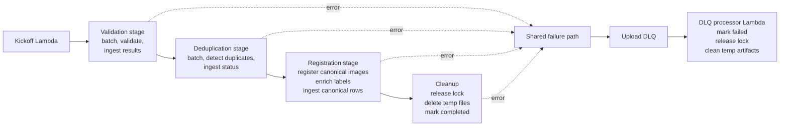
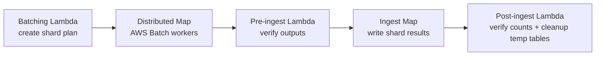
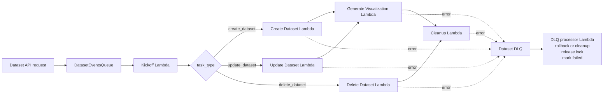

## Stack Overview



## <u>Logging Stack</u>

The **Logging Stack** implements a centralized structured logging pipeline for the application.
All services emit logs using a shared logging utility that writes structured JSON records to an
Amazon Kinesis Firehose delivery stream. Firehose buffers incoming log events, invokes a
transformation Lambda to normalize and validate the log schema, converts the records from JSON to
Parquet using AWS Glue schema definitions, and writes the resulting files to partitioned storage
in Amazon S3. The Glue catalog table allows the logs to be queried efficiently with Amazon Athena
for debugging, monitoring, and operational analysis.

---

## <u>Storage Stack</u>

The **Storage Stack** provisions the persistent infrastructure used by the system to manage
imagery, labels, datasets, and workflow state. It creates the core storage resources used by the
application, including S3 buckets for canonical imagery, Iceberg table storage, and dataset
artifacts; DynamoDB tables for job tracking, image deduplication, global workflow locking, and
dataset version metadata; and SQS queues used for upload event processing and centralized failure
handling. The stack also deploys a Lambda-based custom resource that executes Athena DDL to create
the Iceberg database and tables at deploy time, ensuring the analytical storage layer is
initialized automatically.

Image ingestion workflows write canonical imagery and label artifacts to the **file bucket**, while structured image
and label metadata is stored in **Iceberg tables** located in the Iceberg storage bucket and
registered in the Glue Data Catalog. Upload events are generated via S3 notifications when a
job manifest is uploaded and are pushed to the `UploadEventsQueue`, which later triggers the
upload workflow. Failures from asynchronous services are routed to a workflow **dead-letter queue
(DLQ)** that is consumed by a cleanup Lambda responsible for releasing locks, cleaning temporary
files, and restoring system consistency.

#### Dataset Manifests

Dataset **manifest files** are JSONL files stored separately from the raw imagery in a dedicated **datasets bucket**. Each dataset
is identified by a globally unique `dataset_id` and is versioned to ensure reproducibility.
Each version represents an immutable snapshot that describes the exact images and labels used for
training. Because dataset versions are immutable, training runs remain reproducible even as new
images and labels are added to the system.

Dataset artifacts follow a deterministic layout in S3:

```
datasets_bucket
└── datasets/
    └── <dataset_id>/
        ├── v1/
        │   └── manifests/
        └── v2/
            └── manifests/
```

For example:

```
s3://<cvdms-datasets-bucket-name>/datasets/wildlife_detector/v1/manifests/train.jsonl
```

Metadata about datasets and their versions is stored in DynamoDB, allowing the system to track the latest version
of each dataset while preserving historical snapshots:

**DatasetsTable**
- `dataset_id` (partition key)
- `description`
- `label_type`
- `created_at`
- `latest_version`

**DatasetVersionsTable**
- `dataset_id` (partition key)
- `version` (sort key)
- `manifest_s3_uri`
- `created_at`
- `num_images`

### Images and Labels

The system stores all imagery and label metadata and associations in a normalized set of **Apache Iceberg tables** in the
Iceberg storage bucket. These tables form a queryable data catalog that supports flexible dataset
construction, filtering, and analysis. Iceberg tables are used because they provide efficient
columnar storage (Parquet), scalable metadata management, and strong support for large analytical
queries via Amazon Athena.

### Canonical Imagery Storage

All registered image data are stored in the `canonical_imagery` Iceberg table. Each image that successfully
completes the upload pipeline is assigned a unique `image_id` (UUID) and inserted into this table.
The table contains the canonical reference to the image in the file bucket along with computed
image statistics that can later be used for dataset analysis and filtering (e.g., brightness,
blur metrics, colorfulness, and image dimensions). Images are partitioned by upload date (`day(uploaded_at)`),
allowing efficient time-based queries and improved performance when scanning large datasets in Athena.


### Image Features

These statistics allow dataset creators to analyze dataset quality,
detect problematic imagery (blur, low light, glare), and construct
datasets with controlled distributions of visual conditions. Images
are normalized to either grayscale (1 channel) or RGB (3 channels).
Images with other band counts are rejected during validation. Images
are internally converted to 8-bit luminance for metric computation. For
computational efficiency and consistency, quality metrics are computed
on a downsampled copy of the image with maximum side length of 512 pixels.

Note: For grayscale images, color metrics are not meaningful. The system sets:

- sat_mean = 0
- colorfulness = 0
- color_bucket = low


- **Brightness Metrics**

    - `luma_mean`: Average brightness of the image (computed from grayscale/luminance). Range ≈ **0–255**; lower =
darker (night/underexposed), higher = brighter (sunny/overexposed).
  
    - `luma_p10`: 10th percentile brightness — a “dark baseline” for the image. Range **0–255**; low
values mean lots of very dark pixels/shadows.
  
    - `luma_p90`: 90th percentile brightness — a “bright baseline” for the image. Range **0–255**; high values
mean lots of very bright pixels/highlights/glare.
  
    - `dark_frac`: Fraction of pixels considered “dark” (below the fixed luma threshold of 30).
Range **0.0–1.0**; higher means more of the image is in deep shadow/low-light.
  
    - `bright_frac`: Fraction of pixels considered “bright” (above the fixed luma threshold of 225).
Range **0.0–1.0**; higher means more blown highlights/glare/headlights/overexposure.

- **Contrast Metrics**

    - `contrast_luma_std`: Standard deviation of luma values — a global contrast measure. Range ≈ **0–127+**
(practically 0–100ish); low = flat/low-contrast (foggy/overcast), high = strong contrast (sharp shadows, vivid lighting).
  
    - `contrast_luma_p90_p10`: Difference between bright and dark percentiles (`luma_p90 - luma_p10`), another
robust contrast/dynamic-range measure. Range **0–255**; higher = wider brightness
spread, lower = compressed/flat lighting.

- **Sharpness Metric**

    - `blur_laplacian_var`: Variance of a Laplacian edge filter on grayscale — a “sharpness” proxy. Range is
**unbounded** but typically ~**0–1000+** depending on resolution/downsampling;
lower = blurrier (motion/defocus), higher = sharper edges.

- **Color Metrics**

    - `sat_mean`: Average color saturation (from HSV S channel). Range **0.0–1.0**; low =
gray/washed-out (fog/snow/overcast), high = vivid colors (sunny scenes, strong
chroma).
  
    - `colorfulness`: Hasler–Süsstrunk colorfulness metric combining chroma spread and bias. Range is
**unbounded** but typically ~**0–100+**; low = dull/monochrome scenes, high =
very colorful scenes.

- **Derived Buckets**

  - `lighting_bucket`: Categorical lighting condition derived from luma stats and dark/bright fractions.
One of **night, low_light, normal, bright, glare**; use it for slicing performance
by illumination.

  - `blur_bucket`: Categorical sharpness derived from `blur_laplacian_var`. One of **sharp, mild_blur,
blurry**; helpful for seeing how motion/defocus affects detection.

  - `contrast_bucket`: Categorical contrast derived from `contrast_luma_std`. One of **low, medium,
high**; good for analyzing fog/flat lighting vs normal scenes.

  - `color_bucket`: Categorical color richness derived from `sat_mean` and `colorfulness` (for
grayscale images, defaults to low). One of **low, medium, high**; useful for
separating washed-out vs vivid scenes.

### Image–Label Relationships

Labels are connected to images through the `image_labels` table. This table provides
a **one-to-many relationship** between images and labels. Each row links an `image_id` to a
label identifier (`label_id`) and specifies the label type.

This design supports multiple labeling paradigms:

- **Single-label classification**
- **Multi-label classification**
- **Object detection**
- **Semantic segmentation**
- **Instance segmentation**

For classification tasks, the `label_id` is simply a lowercase string label. For structured
labeling tasks (detection and segmentation), the `label_id` refers to a label artifact stored
in one of the canonical label tables described below.

### Canonical Label Tables

Structured labels are stored in dedicated canonical tables. Each label artifact is identified
by a deterministic **label fingerprint** (a SHA256 hash computed from the normalized label representation), which serves as the unique identifier for that label.
These fingerprints prevent duplicate labels from being registered and allow label enrichment
during future uploads.

The canonical label tables are:

- **`canonical_bounding_boxes`** – stores object detection annotations. Each entry references a JSON metadata file describing bounding boxes and class labels.
- **`canonical_semantic_masks`** – stores semantic segmentation labels consisting of an indexed PNG mask and metadata describing class mappings.
- **`canonical_instance_annotations`** – stores instance segmentation annotations consisting of an indexed PNG mask and metadata describing individual object instances.

Each label artifact stores the set of classes present in the annotation (`classes_present`) to support efficient dataset construction, filtering, and analytics.

### Upload Staging

During ingestion, images are first written to the **`upload_staging`** table. This table acts as
a temporary workspace for the upload workflow and records intermediate processing states,
including:

- validation results
- deduplication status
- registration status
- error messages
- computed image statistics
- temporary references to label artifacts

Once an image successfully completes validation, deduplication, and registration, its
metadata is promoted into the canonical tables.

### Dataset Membership Tables

Datasets are represented by a set of Iceberg tables that record which images belong to a dataset
version. Each dataset is identified by a globally unique `dataset_id`, and each modification
produces a new immutable `version`. These tables enable analytical queries on dataset
composition and allow visualization of dataset statistics.

The dataset membership tables include:

- **`single_label`** – membership for single-label classification datasets
- **`multi_label`** – membership for multi-label classification datasets
- **`object_detection`** – membership for object detection datasets
- **`semantic_segmentation`** – membership for semantic segmentation datasets
- **`instance_segmentation`** – membership for instance segmentation datasets

Each row records a `(dataset_id, version, image_id, label)` or `(dataset_id, version, image_id, annotation_id)` pair depending on the task type.

Dataset membership tables are partitioned by `(dataset_id, version)` to allow efficient retrieval
of specific dataset snapshots.

### Why Iceberg is Used

Apache Iceberg is used for the image catalog and dataset membership tables because it provides:

- Scalable metadata management for very large tables
- ACID table updates with snapshot isolation
- Efficient columnar storage via Parquet
- Time-travel queries for historical dataset inspection
- Seamless integration with Amazon Athena

This allows the system to support analytical queries on millions of images and dataset versions
while maintaining strong consistency guarantees.

---

## <u>Upload Stack</u>



### Upload Stack Architecture

The following explains how the **Upload Stack infrastructure and code
are wired together** to implement the CVDMS upload workflow.

It complements **README_upload.md**, which focuses on:

* supported input formats
* manifest normalization
* user-facing upload behavior

This document instead focuses on:

* Step Functions orchestration
* reusable CDK constructs
* Lambda and Batch responsibilities
* ingestion stages
* concurrency safety
* idempotent writes
* overall pipeline architecture

The goal is to describe **how the upload workflow is engineered internally**.

### High-Level Upload Pipeline

Validation, deduplication, and registration each follow this batching + distributed processing + ingest pattern.



Once the upload client writes `job.json` and the normalized manifest to S3, the following infrastructure activates:

```
S3 Upload
   ↓
UploadEventsQueue (SQS)
   ↓
Kickoff Lambda
   ↓
Upload Step Functions State Machine
```

The Step Functions state machine executes the upload pipeline:

```
Validation Stage
       ↓
Validation Ingest
       ↓
Deduplication Stage
       ↓
Deduplication Ingest
       ↓
Registration Stage
       ↓
Registration Ingest
       ↓
Cleanup
```

Each stage performs a specific responsibility in the dataset ingestion process.
The `upload_staging` table acts as an audit log for every
image processed during the upload workflow. Each stage updates
records within this table, allowing the pipeline to verify ingestion
completeness and maintain traceability of every uploaded image and
any errors that arise.

### Step Functions Workflow Definition

The upload workflow is defined in the CDK stack as a sequential Step Functions chain.

```
Kickoff Lambda
      ↓
Validation batching
      ↓
Validation workers (Batch)
      ↓
Validation ingest (pre → map → post)
      ↓
Dedup batching
      ↓
Dedup workers (Batch)
      ↓
Dedup ingest (pre → map → post)
      ↓
Registration batching
      ↓
Registration workers (Batch)
      ↓
Registration ingest (pre → map → post)
      ↓
Cleanup Lambda
```

The state machine definition in CDK:

```
workflow_definition = sfn.Chain.start(validation_stage.batching_task)
    .next(validation_stage.map_state)
    .next(validation_ingest_stage.pre_ingest_task)
    .next(validation_ingest_stage.map_state)
    .next(validation_ingest_stage.post_ingest_task)
    .next(deduplication_stage.batching_task)
    .next(deduplication_stage.map_state)
    .next(deduplication_ingest_stage.pre_ingest_task)
    .next(deduplication_ingest_stage.map_state)
    .next(deduplication_ingest_stage.post_ingest_task)
    .next(registration_stage.batching_task)
    .next(registration_stage.map_state)
    .next(registration_ingest_stage.pre_ingest_task)
    .next(registration_ingest_stage.map_state)
    .next(registration_ingest_stage.post_ingest_task)
    .next(cleanup_task)
```

Each stage uses reusable infrastructure constructs that encapsulate common workflow patterns.

### Reusable CDK Constructs

The upload pipeline is implemented using two reusable CDK constructs.

```
BatchingStage
IngestStage
```

These constructs encapsulate common processing patterns and make the workflow modular and reusable.

### BatchingStage

The `BatchingStage` construct implements the pattern used for:

* validation
* deduplication
* registration

The pattern consists of two steps:

```
Batching Lambda that partitions the data in chunks
        ↓
Step Functions Map launching AWS Batch jobs
```

Responsibilities of the batching lambda:

* read the dataset input (manifest or Iceberg table)
* partition the workload into deterministic shards
* write shard manifests to S3
* return shard descriptors to the Step Functions Map state

Each AWS Batch worker processes **one shard**.

This pattern allows:

* massive parallelism
* deterministic work partitioning
* retry-safe processing

### IngestStage

After worker jobs finish, the `IngestStage` construct performs deterministic ingestion of the worker outputs.

Each ingest stage has three steps:

```
Pre Lambda
     ↓
Step Functions Map running the Shard Ingest Lambda
     ↓
Post Lambda
```

### Pre Lambda

The pre-ingest lambda performs validation and shard discovery.

Responsibilities include:

* discovering worker outputs
* validating expected shard counts
* verifying worker success markers
* ensuring shard completeness
* returning ingestion map items

This stage guarantees that ingestion begins **only if worker outputs are complete and consistent**.

### Map Lambda

The ingest map lambda processes **one shard of worker output**.

Responsibilities include:

* reading worker JSONL outputs
* writing rows into Iceberg tables
* applying idempotent write strategies
* updating upload_staging audit rows

Different tables use different insertion strategies to guarantee safe retries.

### Post Lambda

The post-ingest lambda performs final verification.

Responsibilities:

* verify upload_staging row counts
* confirm ingestion parity with batching outputs
* drop temporary Athena CTAS tables
* emit final ingestion metrics

This stage acts as the **final integrity checkpoint** before workflow cleanup.

### First step: <u>Validation Stage</u>

The validation stage processes the standardized `cvdms.manifest.v1` manifest.

Responsibilities include:

* verifying image existence
* opening images and extracting metadata
* computing SHA256 image hashes
* validating labels and annotations
* validating segmentation masks
* computing label fingerprints
* generating upload_staging rows

Worker outputs are written under:

```
temp/image-upload/<job_id>/batches/validation-step/
```

These outputs are later consumed by the validation ingest stage.

### Second step: <u>Deduplication Stage</u>

Deduplication identifies duplicate images using SHA256 hashes and
uses DynamoDB and Athena to produce worker shards.

Two duplicate types exist:

- **internal_duplicate**: Multiple identical images appear in the same
upload. Resolution: one representative is retained and all others are ignored.

- **external_duplicate**: The image already exists in the canonical
dataset. Resolution: the image is not re-registered and labels may 
be enriched

  
### Third step: <u>Registration Stage</u>

Registration performs canonical dataset updates. If the image
is new (`passed`), a canonical image record is created and inserted into the canonical dataset.

For external duplicates (the image already exists in the system), either:

• no operation is performed if the image–label pair already exists  
• the image is enriched with newly introduced labels


### Label Enrichment Process

Label enrichment uses **deterministic fingerprints** for labels.

Fingerprints are computed for each label artifact, such as:

* bounding boxes
* semantic segmentation masks
* instance segmentation masks

If a fingerprint is not present in the canonical tables, then
a new canonical label row is inserted. If the fingerprint already
exists, then no new label is inserted. This guarantees deterministic
label enrichment behavior.

### Sharding Strategy

Registration workers shard records by `target_image_id`, which is the 
`image_id` assigned to the new image, or the `matched_image_id` in the
case of an external duplicate. This guarantees that all operations
affecting the same canonical image are handled by the same shard and
eliminates race conditions during registration.

### Canonical Label Owner Shards

Canonical label rows are stored using **fingerprint owner shards**.

Structure:

```
canonical_labels_by_fingerprint/
    owner-000001/
    owner-000002/
```

This design prevents multiple workers from attempting to insert the same canonical label simultaneously.

### Idempotent Writes

Different table types use different insertion strategies:

#### Delete-then-insert tables:

Used for shard-owned tables, such as the `upload_staging` and
`canonical_imagery` tables, which can safely be replaced
because the shard owns the rows.

#### Insert-only tables:

Used for globally shared tables, such as the `image_labels` and the
canonical label tables. These tables use conditional insertion
to avoid duplicate rows, ensuring ingestion remains safe under retries.

### Concurrency and Race Prevention

Several architectural decisions ensure safe parallel execution.

### Image ownership sharding

```
target_image_id → single shard
```

This guarantees no concurrent writes to the same canonical image.

### Label ownership sharding

Canonical label rows are inserted by fingerprint owner shards, preventing
cross-shard label insertion races.

### Pre-ingest shard verification

The pre-ingest stage verifies that:

- all worker shards completed
- all expected outputs exist
- owner shards are complete


This prevents ingestion from running on partial worker outputs.

### Atomicity Guarantees

The pipeline achieves atomic behavior through:

- deterministic worker outputs
- idempotent database writes
- upload_staging audit table
- post-ingest verification

### Cleanup Step

The final step of the workflow is the cleanup lambda.

Responsibilities include:

- release workflow lock
- mark job as `COMPLETED`
- delete temporary upload artifacts


Temporary files under:

```
temp/image-upload/<job_id>/
```

are removed once the workflow finishes successfully.

### Shared Helper Modules

Both Lambda functions and AWS Batch workers use shared
Python helper modules located under `common/`.

These modules provide utilities for interacting with:

* Athena
* DynamoDB
* S3
* Iceberg tables
* structured logging

Centralizing this logic keeps ingestion code consistent
across workers and Lambdas.

## <u>Dataset Stack</u>



### Dataset Stack Architecture

The **Dataset Stack** implements the workflow for creating, updating, deleting, and visualizing versioned datasets after imagery and labels have already been registered by the upload workflow.

Where the Upload Stack focuses on ingesting raw imagery and labels into the canonical catalog, the Dataset Stack focuses on selecting from that catalog and producing reproducible dataset versions for downstream training.

The stack supports three main dataset operations:

* `create_dataset`
* `update_dataset`
* `delete_dataset`

It also runs visualization generation for create and update operations so dataset versions can be inspected in the local Streamlit visualization tool.

### High-Level Dataset Pipeline

Dataset operation requests are submitted through the programmatic API and routed through the dataset workflow.

```text
Dataset API request
        ↓
Dataset submission event
        ↓
DatasetEventsQueue
        ↓
Kickoff Lambda
        ↓
Dataset Step Functions State Machine
```

The state machine routes work by `task_type`.

```text
create_dataset
        ↓
Create Dataset Lambda
        ↓
Generate Visualization Lambda
        ↓
Cleanup Lambda

update_dataset
        ↓
Update Dataset Lambda
        ↓
Generate Visualization Lambda
        ↓
Cleanup Lambda

delete_dataset
        ↓
Delete Dataset Lambda
        ↓
Cleanup Lambda
```

Unsupported task types are routed to a Step Functions failure state.

### Dataset Operations

#### Create Dataset

The create operation builds a new dataset from canonical imagery and label tables.

Responsibilities include:

* validating the dataset request
* applying the selection configuration
* selecting matching images and labels from Iceberg tables
* generating split assignments
* writing task-specific dataset membership rows
* creating dataset artifacts in the datasets bucket
* updating DynamoDB dataset metadata

Create operations produce a new dataset version.

#### Update Dataset

The update operation creates a new immutable version of an existing dataset.

Responsibilities include:

* loading the existing dataset context
* applying the requested update operation
* preserving or rebalancing splits depending on the request
* writing new membership rows for the new version
* writing updated dataset artifacts
* updating dataset version metadata

The previous dataset versions remain available for reproducibility.

#### Delete Dataset

The delete operation removes dataset metadata and dataset artifacts for the requested dataset.

Unlike create and update operations, delete operations do not run visualization generation. After the delete task completes, the workflow proceeds directly to cleanup.

### Visualization Generation

For create and update operations, the Dataset Stack runs a visualization generation task before cleanup.

This task writes dataset-level summary artifacts used by the Streamlit visualization tool, including split distributions, class distributions, image-quality summaries, and related dataset inspection outputs.

These artifacts allow users to inspect a dataset version before using it for model training.

### Cleanup Step

The cleanup task finalizes the dataset workflow.

Responsibilities include:

* releasing workflow locks
* updating job status
* cleaning temporary dataset operation files
* finalizing workflow metadata

Temporary dataset operation files are stored under:

```text
temp/dataset-ops/
```

### Dataset DLQ Handling

The Dataset Stack uses a dataset-specific DLQ processor for workflow failures.

Create, update, and visualization failures use rollback behavior intended to clean up incomplete new dataset versions. Delete failures use delete-specific cleanup behavior.

The workflow attaches DLQ context including:

* `job_id`
* `user`
* `event_type`
* `task_type`
* `dataset_context`
* failed stage
* DLQ policy
* serialized error information

This gives the DLQ processor enough context to restore consistency after failed dataset operations.

### Shared Resources and Permissions

Dataset workflow Lambdas receive access to the shared CVDMS resources needed for dataset construction and cleanup, including:

* `JobTable`
* `DatasetsTable`
* `DatasetVersionsTable`
* `LockTable`
* file bucket
* datasets bucket
* Iceberg bucket
* Athena workgroup
* Glue catalog tables
* Firehose logging stream

The Dataset Stack also creates its own Lambda layer from `workers/common`, allowing dataset Lambdas to reuse the same shared helpers used elsewhere in the system.

### Failure Testing Parameter

The Dataset Stack creates an SSM parameter used to test dataset workflow failure handling:

```text
/cvdms/<app_name>/dataset/testing/fail_control
```

This parameter can be manually updated during development to trigger controlled failures and validate DLQ behavior.
