# Global Wheat Head Detection 2021 Dataset Exploration

## Overview

This project uses the **Global Wheat Head Detection 2021** dataset as the source dataset for an end-to-end object detection workflow. The task is to detect and localize individual wheat heads in field imagery using bounding-box annotations.

This is a single-class object detection dataset. The class used in this project is:

The dataset is well suited for a portfolio object-detection project because it is not a trivial COCO-style transfer-learning example. It is a dense small-object detection problem: many images contain dozens of wheat heads, often packed closely together, partially occluded, or visually similar to the surrounding crop structure. This makes the task more challenging than sparse object detection because the model must maintain high recall while separating nearby object instances.

The Global Wheat Head Detection 2021 dataset extends the earlier 2020 dataset with additional imagery from new acquisition sessions. The dataset source describes it as containing more than 6,000 images of 1024×1024 pixels with more than 300,000 unique wheat-head annotations.

## CVDMS Dataset Formation

The dataset was ingested into CVDMS and then formed into a versioned CVDMS object-detection dataset. See the [CVDMS CDK infrastructure](../../../AWS_Tools/Computer_Vision_DMS/cvdms_cdk/) for the underlying AWS/CDK data-management system.

CVDMS preserved the official source train, validation, and test splits for this dataset. This matters because the dataset was not randomly re-split after ingestion. Instead, the model-training workflow uses the same split structure provided by the dataset source.

The CVDMS dataset version has the following core properties:

```text
dataset_id: global-wheat-head-2021
version: 1
label_type: object-detection
effective_split_mode: honor_source_splits
class_to_idx: {"wheat_head": 0}
```

The exported dataset contains:

```text
train: 3,605 images
val:   1,448 images
test:  1,334 images
total: 6,387 images
```

CVDMS produced versioned dataset artifacts including:

```text
metadata.json
train.jsonl
val.jsonl
test.jsonl
dataset visualization/profile artifacts
```

The exported CVDMS manifests are then cached locally, explored visually, converted to YOLO format, and used for Ultralytics YOLO training.

## Split Overview

The following plot shows the number of images in each split.

<p align="center">
  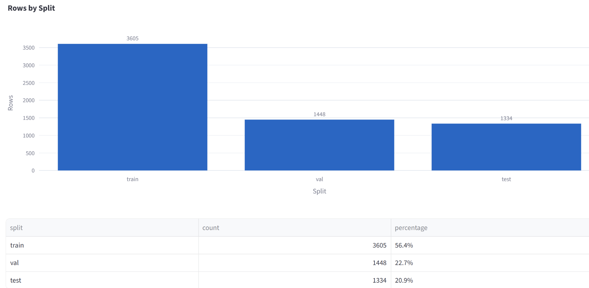<br>
  <em>Split breakdown of the Global Wheat Head 2021 dataset.</em>
</p>

The training set is the largest split, while validation and test remain large enough to support meaningful model evaluation. Because the official source splits are preserved, these partitions should be treated as fixed evaluation splits rather than interchangeable random subsets.

## How CVDMS Image Features Are Computed

During dataset validation and profiling, CVDMS computes lightweight image-quality features for each image. These features are not model predictions. They are dataset diagnostics used to understand visual conditions across train, validation, and test splits before training begins.

For consistency and speed, CVDMS computes these metrics on a downsampled copy of each image with maximum side length 512 pixels. Images are internally converted to 8-bit luminance/RGB-derived representations before feature extraction.

The plots below use two kinds of features:

1. **Continuous numeric metrics**, shown as histograms.
2. **Categorical quality buckets**, shown as bar charts.

The distinction is important. For example, `colorfulness` is a continuous numeric value, while `color_bucket` is a categorical summary such as `low`, `medium`, or `high`.

### Continuous Metrics

* **Colorfulness**: A numeric measure of how visually colorful an image is. CVDMS uses a colorfulness metric based on color-channel variation and color bias. Low values indicate dull, gray, washed-out, or nearly monochrome imagery. High values indicate more vivid or chromatically rich imagery.

* **Contrast luminance standard deviation (`contrast_luma_std`)**: A numeric measure of global contrast. It is the standard deviation of luminance values in the image. Low values indicate flatter, lower-contrast imagery; high values indicate stronger light/dark separation, sharper shadows, or more pronounced visual edges.

* **Dark fraction (`dark_frac`)**: The fraction of pixels whose luminance is below a fixed darkness threshold. In CVDMS this threshold is 30 on an approximate 0–255 luminance scale. Higher values mean more of the image is very dark or shadowed.

* **Bright fraction (`bright_frac`)**: The fraction of pixels whose luminance is above a fixed brightness threshold. In CVDMS this threshold is 225 on an approximate 0–255 luminance scale. Higher values can indicate glare, overexposure, or strong highlights.

### Quality Buckets

CVDMS also converts some continuous metrics into categorical buckets so split-level differences are easier to inspect.

* **`color_bucket`**: A categorical summary derived from saturation and colorfulness. Values are `low`, `medium`, or `high`. This is related to the numeric colorfulness metric, but it is not the same thing: `colorfulness` is continuous, while `color_bucket` is grouped.

* **`contrast_bucket`**: A categorical summary derived from `contrast_luma_std`. Values are `low`, `medium`, or `high`. It summarizes whether an image has flat, moderate, or strong luminance contrast.

* **`lighting_bucket`**: A categorical summary derived from luminance statistics and dark/bright pixel fractions. Values include `night`, `low_light`, `normal`, `bright`, and `glare`. It summarizes the overall illumination condition of the image.

* **`blur_bucket`**: A categorical summary derived from the variance of a Laplacian edge filter. Values include `sharp`, `mild_blur`, and `blurry`. Lower Laplacian variance usually indicates less edge detail, which can suggest motion blur, defocus, or other softness.

These metrics are useful because they reveal visual-domain differences that may affect detection difficulty, especially for dense small-object detection.

## Image Feature Analysis

The following plot shows the colorfulness distribution by split.

<p align="center">
  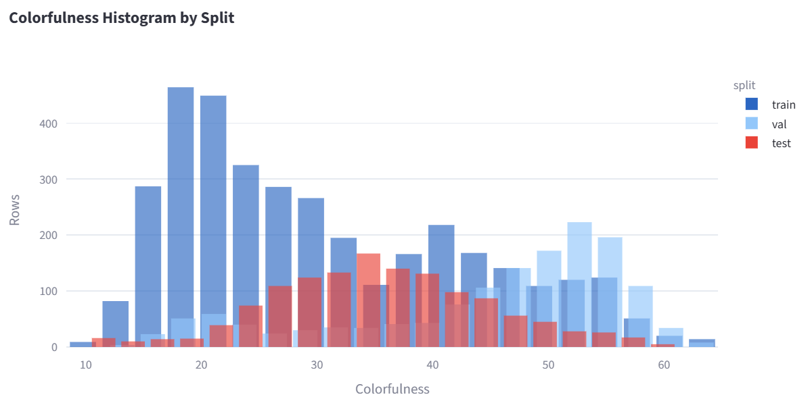<br>
  <em>Split breakdown of the colorfulness metric.</em>
</p>

The colorfulness distributions differ noticeably between splits. This suggests that the train, validation, and test partitions are not visually identical in terms of saturation and color richness. In practice, this can happen when images come from different acquisition sessions, field conditions, cameras, lighting conditions, crop states, or geographic domains.

For model training, this is important because a detector trained on one color distribution may see validation or test imagery with different color richness. This motivates the use of photometric augmentation, especially HSV saturation/value augmentation, to improve robustness.

The following plot shows the luminance-contrast distribution by split.

<p align="center">
  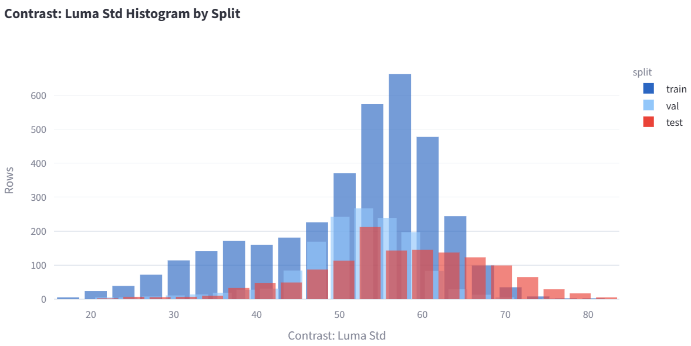<br>
  <em>Split breakdown of the contrast metric.</em>
</p>

The contrast distributions are broadly similar in shape, but the splits still show differences in the amount of high-contrast imagery. Contrast is particularly relevant for wheat-head detection because wheat heads can be small and visually similar to the background. Stronger or weaker contrast can affect edge visibility, object separation, localization quality, and detector confidence.

The following plot shows the distribution of dark pixel fractions by split.

<p align="center">
  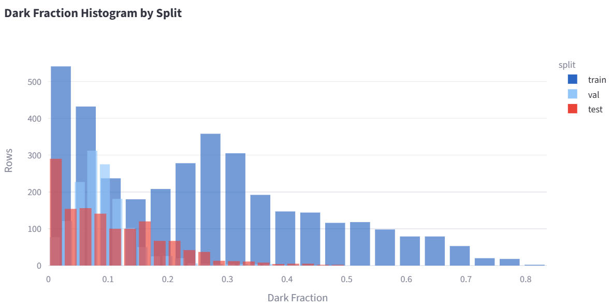<br>
  <em>Split breakdown of the dark fraction metric.</em>
</p>

The dark-fraction histogram shows that the splits differ in their lighting characteristics. Most images cluster toward lower dark-fraction values, but the training and validation sets show additional structure that is less evident in the test set. This indicates that the official splits contain different lighting regimes, which may affect model generalization.

## Split Drift Warnings

The CVDMS feature visualization tool flagged several split-level differences in image-quality buckets. These warnings are useful because they identify potential train/validation/test distribution drift before model training.

The most important warnings were:

```text
Color quality drift in validation:
Bucket 'medium' differs by 40.0% between val and train
val: 15.6%, train: 55.6%

Lighting quality drift in test:
Bucket 'normal' differs by 35.2% between test and train
test: 77.1%, train: 42.0%

Lighting quality drift in validation:
Bucket 'normal' differs by 42.4% between val and train
val: 84.3%, train: 42.0%

Contrast quality drift in test:
Bucket 'high' differs by 19.9% between test and train
test: 24.7%, train: 4.9%
```

These warnings do not mean the dataset is invalid. Instead, they reveal a realistic machine-learning problem: the official splits contain measurable visual differences. The model will need to generalize across changes in color richness, lighting, and contrast.

The color-quality bucket distribution is shown below.

<p align="center">
  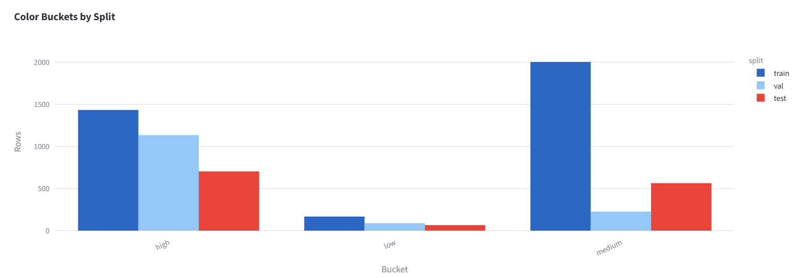<br>
  <em>Split breakdown of the color categories assigned to the images of each split.</em>
</p>

The validation split has far fewer images in the `medium` color bucket than the training split. This indicates a shift in color richness between training and validation imagery. Because the model is trained on the training split but selected using validation performance, this type of split drift can influence model-selection behavior.

The lighting-bucket distribution is shown below.

<p align="center">
  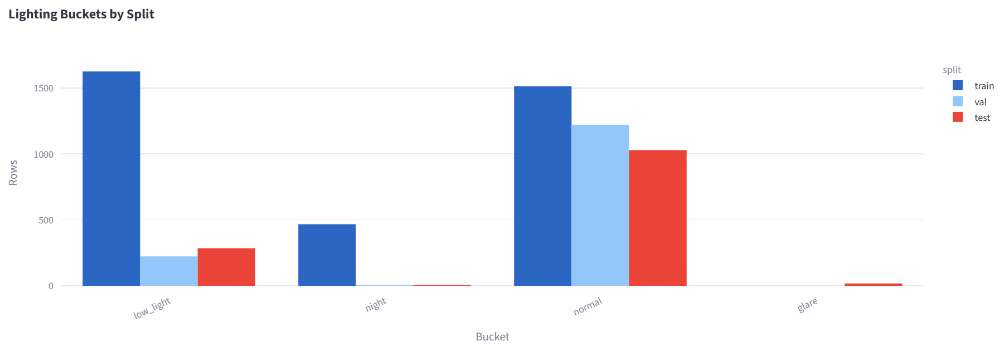<br>
  <em>Split breakdown of the lighting categories assigned to the images of each split.</em>
</p>

The lighting drift is especially important. Validation and test contain a much larger share of `normal` lighting images than training. The training split contains more low-light and night-like imagery, while validation and test are more heavily concentrated in normal lighting conditions.

This creates an interesting dataset story: the model is not simply being evaluated on imagery drawn from an identical visual distribution. Instead, CVDMS reveals that the official source splits differ in measurable lighting conditions.

The contrast-bucket distribution is shown below.

<p align="center">
  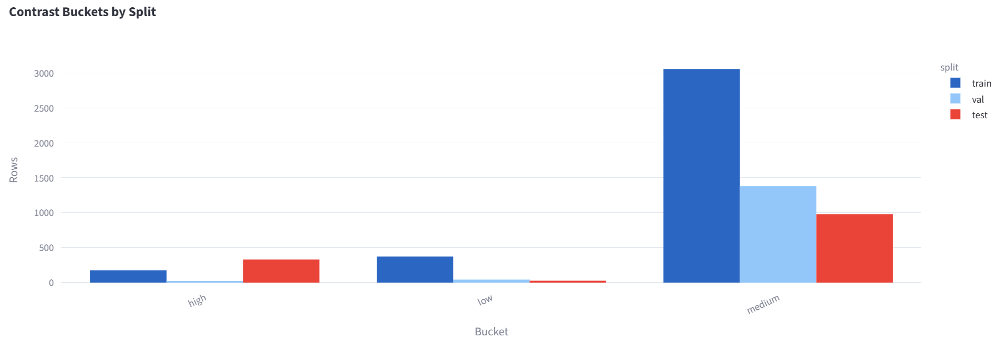<br>
  <em>Split breakdown of the contrast categories assigned to the images of each split.</em>
</p>

The test split contains a higher proportion of `high` contrast images than the training split. This matters because contrast can affect small-object boundary visibility. A detector may perform differently on high-contrast scenes than on lower-contrast or more visually compressed imagery.

## Interpretation

The most important dataset finding is that the official splits are not visually identical.

CVDMS reveals drift in:

```text
color richness
lighting conditions
contrast conditions
```

For this project, that is not just a data-quality note. It directly informs the training strategy.

Because wheat-head detection is a dense small-object localization problem, visual conditions can affect:

```text
object/background separation
edge visibility
localization quality
confidence calibration
false negatives in low-visibility regions
duplicate or missed detections in dense clusters
```

This makes the dataset useful for an employer-facing project. The project is not only “train YOLO on a public dataset.” It demonstrates a workflow where dataset-management tooling surfaces split-level visual drift, and those findings influence the training and evaluation plan.

## Truth Visualization and Mosaics

The following examples show ground-truth bounding boxes. The red boxes mark individual wheat-head instances.

Many boxes overlap because each wheat head is labeled as a separate object instance. In dense crop imagery, nearby wheat heads can be tightly packed, partially occluded, or visually touching. Overlapping truth boxes are therefore expected and should not be treated as duplicate labels by default.

<p align="center">
  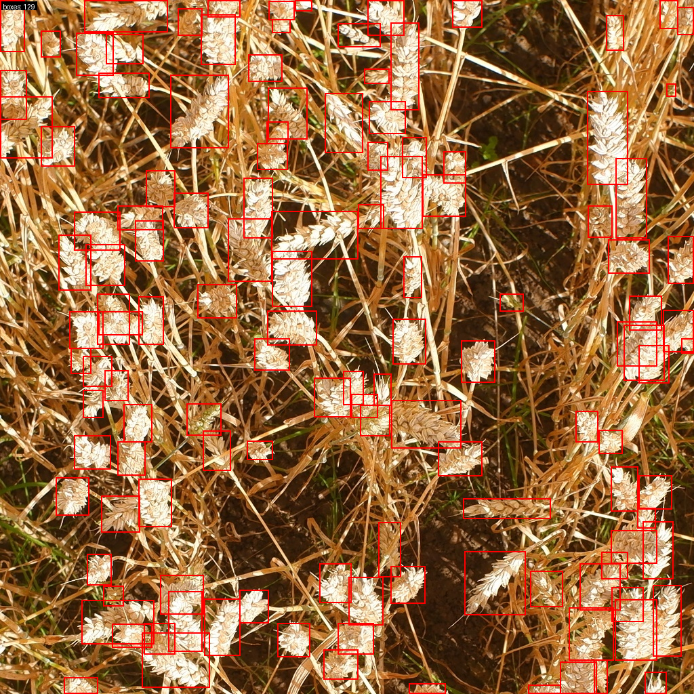<br>
  <em>Sample training image with ground-truth wheat-head bounding boxes shown in red.</em>
</p>

<p align="center">
  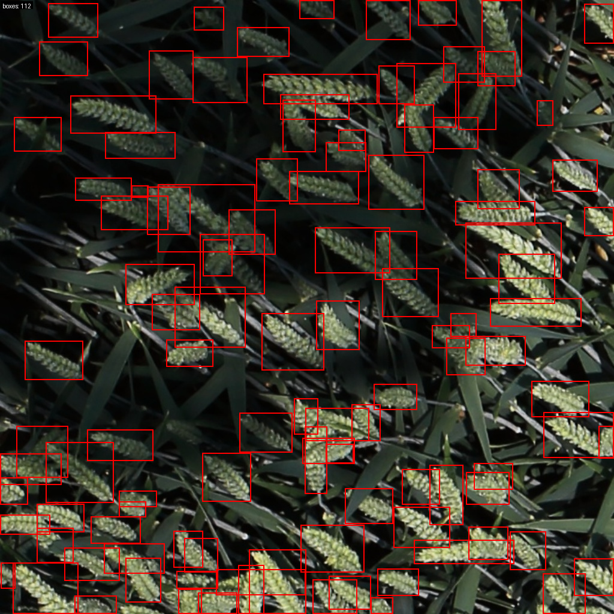<br>
  <em>Another training image showing dense ground-truth wheat-head annotations.</em>
</p>

The following mosaics show 5×5 grids of sample images. Each original image is 1024×1024 pixels and is resized to a 256×256 tile for visualization. Red boxes show the ground-truth annotations after scaling into the mosaic tile.

<p align="center">
  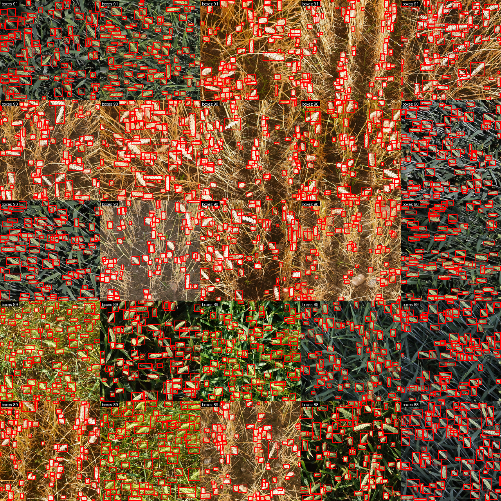<br>
  <em>A mosaic of 25 training images with ground-truth wheat-head boxes shown in red.</em>
</p>

<p align="center">
  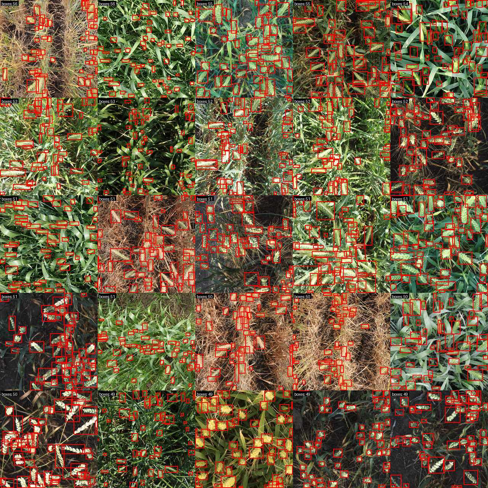<br>
  <em>A mosaic of 25 validation images with ground-truth wheat-head boxes shown in red.</em>
</p>

These mosaics show that the dataset contains dense object instances and meaningful visual variation. The model must learn to detect many small, similar objects across changing field conditions, lighting conditions, and image appearances.

## Training Plan

The next stage is to convert the cached CVDMS dataset artifacts into Ultralytics YOLO format and fine-tune a pretrained YOLO detector.

The high-level training workflow is:

```text
CVDMS manifests and bbox labels
-> local cache
-> YOLO-format dataset
-> Ultralytics YOLO fine-tuning
-> MLflow experiment tracking
-> explicit validation and test evaluation
-> model registry selection
-> FastAPI/Docker serving
```

Because CVDMS detected split-level drift in color, lighting, and contrast, the first training runs should include targeted photometric augmentation. The goal is not to hide the distribution shift, but to make the detector more robust to the kinds of visual variation already observed in the dataset.

Planned augmentation strategy:

```text
HSV hue/saturation/value augmentation
brightness/value variation
moderate contrast-related variation
horizontal flips
moderate scale and translation augmentation
YOLO mosaic augmentation during early training
mosaic disabled near the end of training
```

The geometric augmentations should remain moderate. This is a dense small-object detection task, so overly aggressive geometric transforms could make object localization less realistic. Photometric augmentation is the most directly motivated response to the CVDMS findings.

The first baseline run will fine-tune a pretrained YOLO detector on the converted YOLO dataset. Validation metrics will be used for model selection, while the test split will be reserved for final reporting.

Future evaluation should also slice model performance by CVDMS quality buckets, such as:

```text
lighting_bucket
contrast_bucket
color_bucket
blur_bucket
```

This would allow the project to report not only aggregate mAP, precision, and recall, but also whether the detector performs differently under specific visual conditions.

## Dataset Source

DAVID Etienne. (2021). Global Wheat Head Dataset 2021 (1.0) [Data set]. Zenodo. [https://doi.org/10.5281/zenodo.5092309](https://doi.org/10.5281/zenodo.5092309)

Main homepage: [https://www.global-wheat.com/gwhd.html](https://www.global-wheat.com/gwhd.html)

Download site: [https://zenodo.org/records/5092309](https://zenodo.org/records/5092309)

