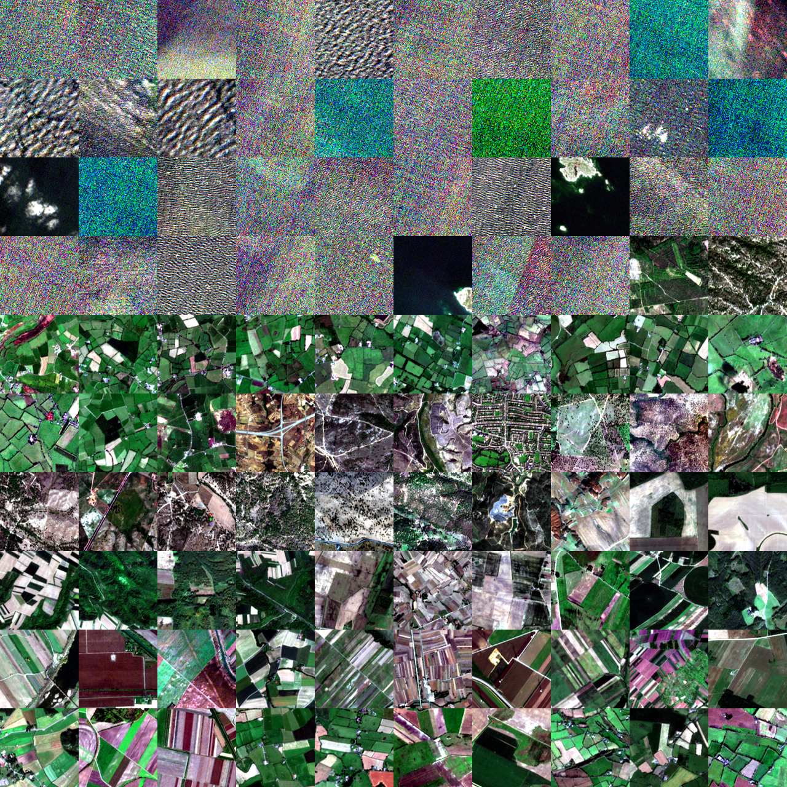

# BigEarthNet v2 Multi-Label Classifier

This project demonstrates a multi-label computer vision training workflow using CVDMS dataset artifacts as the source
of truth. It trains a PyTorch model on a 17-class BigEarthNet v2 dataset version
exported from CVDMS, using multi-hot labels, BCE-with-logits loss, thresholded
predictions, and multi-label evaluation metrics.

## Usage

Run all commands from the project root.

This project uses CVDMS dataset metadata and manifests from S3,
but image files should be mirrored locally before training.
Reading thousands of images repeatedly from S3 during each epoch
is slow and creates unnecessary data-transfer usage. The local
cache keeps the CVDMS `source_ref` values unchanged while storing
each image under the same S3 key path beneath the configured
cache directory. This also removes a common local-training
bottleneck: the CPU and network spend time fetching, decoding,
and transforming images while the GPU sits idle waiting for
the next batch.

First, cache the dataset images:

```bash
python source/cache_dataset.py --config config.yaml
````

The cache location is configured in `config.yaml`:

```yaml
data:
  image_loader:
    mode: "local_mirror"
    cache_dir: "outputs/image_cache/bigearthnetv2_multi_label_v1"
```

For example, this S3 image:

```text
s3://bucket/canonical/images/bigearthnetv2/images/training/example.png
```

is cached locally as:

```text
outputs/image_cache/bigearthnetv2_multi_label_v1/canonical/images/bigearthnetv2/images/training/example.png
```

After caching, verify the dataset wiring:

```bash
python source/inspect_dataset.py --config config.yaml
```

The inspection script checks that metadata, manifests, local image
loading, transforms, DataLoaders, and multi-hot labels are working
correctly. It does not train a model.

Then start training:

```bash
python source/train.py --config config.yaml
```

## Dataset

The following charts were generated from the custom CVDMS visualization tool. 
Shown images are available in the [readme_imgs](readme_imgs/) folder.
See the [CVDMS CDK infrastructure](../../../AWS_Tools/Computer_Vision_DMS/cvdms_cdk/)
for more context on the dataset creation pipeline.

This dataset is a small curated subset of BigEarthNet v2, consisting of 5,000 training
images, 1,000 validation images, and 1,000 test images.

<p align="center">
  <br>
  <em>CVDMS dataset visualization overview for a subset of the BigEarthNet v2 multi-label dataset.</em>
</p>

The following chart shows the class distribution across the train, validation, and test splits.
Note the heavy class imbalance, which is one of the primary known challenges of this dataset.

<p align="center">
  <br>
  <em>Class breakdown by split.</em>
</p>

The following chart summarizes lighting categories by split. These image-quality summaries are
produced by the CVDMS visualization tool using Streamlit. The lighting distribution
is roughly consistent across the train, validation, and test splits.

<p align="center">
  <br>
  <em>Lighting breakdown by split.</em>
</p>

The following histogram shows the dark fraction distribution for each split.
Dark fraction is the fraction of image pixels whose brightness, or luma, falls
below a predefined dark threshold. Higher values indicate that a larger portion
of the image is composed of dark pixels.

For satellite imagery, this can help identify shadows, dark forested regions,
water-heavy scenes, cloudy or dim imagery, and other brightness-related distribution
differences. In this dataset, the dark fraction distributions are broadly similar
across splits, with visible clustering near 0.1.

<p align="center">
  <br>
  <em>Dark fraction distribution by split.</em>
</p>

The following histogram compares image contrast across splits. Here,
contrast is approximated using luma standard deviation. Lower luma standard
deviation means most pixels have similar brightness values, producing a flatter
or lower-contrast image. Higher luma standard deviation means brightness values
vary more strongly across the image, which corresponds to stronger contrast.

<p align="center">
  <br>
  <em>Contrast distribution by split.</em>
</p>

We can create mosaics of the dataset via the following command:

```bash
python source/generate_mosaics.py --config config.yaml --splits train val test --rows 10 --cols 10 --tile-size 128 --group-mode none --order-strategy cardinality_signature
````

This will make mosaics for each split.

`--order-strategy cardinality_signature` means the mosaic script orders images by their multi-label structure rather than by filename or random order. Images are first ordered by label cardinality (number of labels), then by exact label combination, so similar multi-label examples tend to appear near each other.

Alternatively, you can group by label cardinality:

```bash
python source/generate_mosaics.py --config config.yaml --splits train val test --rows 10 --cols 10 --tile-size 128 --group-mode cardinality
```

That creates separate mosaic groups for 1-label, 2-label, 3-label, etc. images, which can be useful for understanding label complexity across the dataset.

For the most detailed grouping, you can use exact label-signature grouping:

```bash
python source/generate_mosaics.py --config config.yaml --splits train val test --rows 10 --cols 10 --tile-size 128 --group-mode signature
```

This groups mosaics by exact class combination within each cardinality folder, so images with different multi-label combinations do not mix within the same mosaic sheet.

Below are two mosaic examples from the test set, produced by setting `--order-strategy cardinality_signature`. Images are ordered by label cardinality first, then by exact label signature, so visually and semantically similar examples tend to appear near each other.

<p align="center">
  <br>
  <em>First test-set mosaic sheet.</em>
</p>

<p align="center">
  <br>
  <em>Second test-set mosaic sheet.</em>
</p>

The transition from one label signature to the next is visible across the sheets. This makes the mosaics useful for inspecting how images cluster by label count and unique class combination.

## Training Trouble

BigEarthNet v2 is a challenging multi-label dataset because several land-cover classes are visually and semantically similar. Classes such as `broad_leaved_forest`, `coniferous_forest`, `mixed_forest`, and `transitional_woodland_shrub` often overlap in appearance, while agricultural classes such as `arable_land`, `pastures`, `complex_cultivation_patterns`, and `land_principally_occupied_by_agriculture_with_significant_areas_of_natural_vegetation` can also look very similar from overhead imagery. This makes class separation difficult and helps explain why thresholded classification performance is more modest than in simpler single-label settings. At the same time, the model is not simply failing: it learns more visually distinct classes well. It shows strong performance on visually distinctive classes such as `marine_waters`, and reasonable performance on well-represented classes such as `arable_land`, `coniferous_forest`, and `mixed_forest`.

To test whether part of the problem was threshold calibration rather than representation quality alone, I ran an additional experiment using the best validation checkpoint. Instead of applying a single global threshold of 0.5 to every class, I selected a separate threshold per class using validation predictions only, froze those thresholds, and then evaluated them on the test set. This improved thresholded metrics modestly: macro F1 increased from 0.5521 to 0.5603, micro F1 from 0.6530 to 0.6602, hamming accuracy from 0.8612 to 0.8714, and subset accuracy from 0.1490 to 0.1640. The main tradeoff was that macro precision improved while macro recall dropped, showing that the per-class thresholds mostly helped by reducing class-specific over-prediction. In other words, threshold tuning helped, but it did not fully solve the problem.

The diagnostic matrices make the remaining issue clearer: the mistakes are structured rather than random. The model tends to group classes into meaningful clusters, especially forest / woodland / shrub classes and agriculture / pasture / cultivation classes. One especially notable pattern is that `transitional_woodland_shrub` often acts as a broad catch-all prediction when the model is uncertain among nearby vegetation-heavy classes. This is a useful result in its own right, because it shows the model has learned meaningful visual structure, but that the dataset itself contains genuine ambiguity and overlap between related labels.

Below is a summary of the test set performance before and after per-class thresholding.

__Test-set metric comparison (best checkpoint)__

| Metric           | Global threshold 0.5 | Per-class thresholds from validation |    Change |
| ---------------- | -------------------: | -----------------------------------: | --------: |
| Macro precision  |               0.4824 |                               0.5394 |   +0.0570 |
| Macro recall     |               0.6727 |                               0.6033 |   -0.0694 |
| Macro F1         |               0.5521 |                               0.5603 |   +0.0083 |
| Micro F1         |               0.6530 |                               0.6602 |   +0.0072 |
| Hamming accuracy |               0.8612 |                               0.8714 |   +0.0102 |
| Subset accuracy  |               0.1490 |                               0.1640 |   +0.0150 |
| mAP              |               0.5761 |                               0.5761 | unchanged |


__Missed-vs-extra label heatmap.__

Rows indicate true labels that the model missed, while columns indicate extra labels that the model incorrectly predicted. Bright off-diagonal cells show the most common substitution-like mistakes. The strongest patterns occur among visually and semantically similar land-cover groups, especially forest/woodland/shrub classes and agricultural mosaic classes.

<p align="center">
  <br>
  <em>Missed versus extra label heatmap on the test set using the best checkpoint model.</em>
</p>

The vertical bands show classes that are frequently predicted as extra labels across many missed true classes. In this run, those bands are concentrated around semantically broad or visually similar land-cover categories.

__Common confusion patterns__

| Pattern | Interpretation |
| --- | --- |
| Forest classes → `transitional_woodland_shrub` | The model often groups wooded or patchy vegetation scenes into a broad shrub/woodland class. |
| `broad_leaved_forest` / `mixed_forest` / `coniferous_forest` | Forest-type boundaries are visually subtle from overhead imagery. |
| `pastures` / `complex_cultivation_patterns` / `arable_land` | Agricultural land-cover categories share field textures and mosaic patterns. |
| `land_principally_occupied_by_agriculture_with_significant_areas_of_natural_vegetation` | This class is inherently mixed, so confusion with agriculture and shrub/woodland classes is expected. |
| `marine_waters` | This class remains comparatively clean, supporting that the model can learn visually distinctive labels. |

A [separate false-association probability heatmap](readme_imgs/false_association_probability_heatmap.png) was also generated to inspect soft probability-level associations, but the missed-vs-extra matrix is used here because it most directly reflects thresholded prediction mistakes.