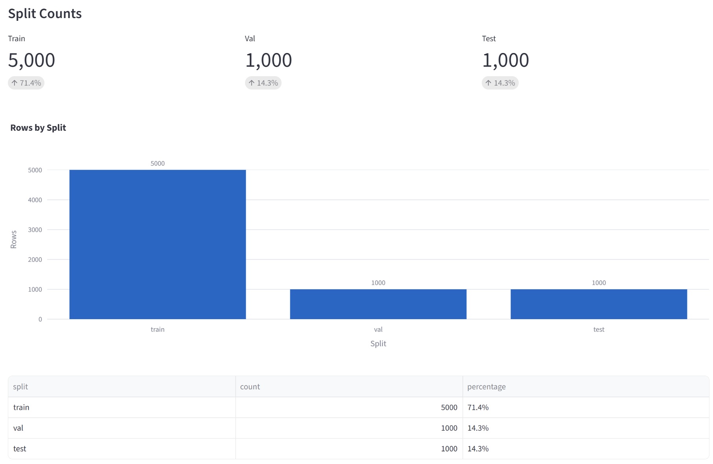
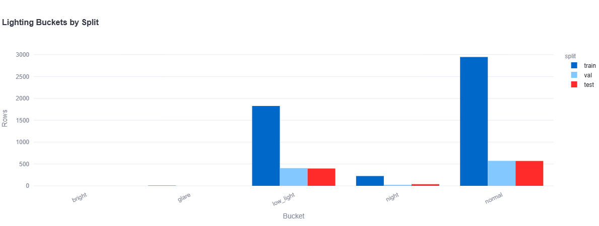
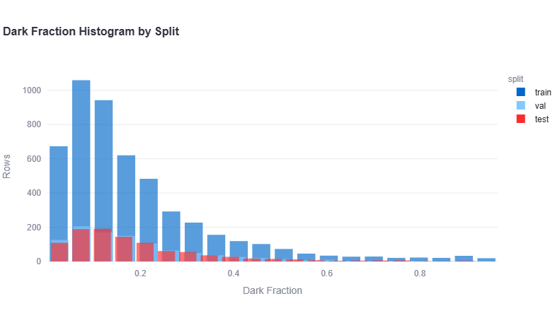
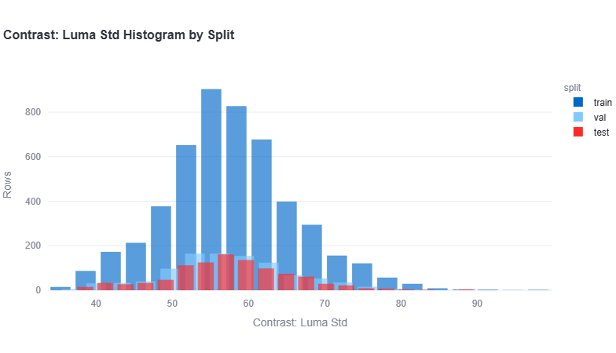

# BigEarthNet v2 Multi-Label Classifier

This project demonstrates a multi-label computer vision training workflow using CVDMS dataset artifacts as the source
of truth. It trains a PyTorch model on a 17-class BigEarthNet v2 dataset version
exported from CVDMS, using multi-hot labels, BCE-with-logits loss, thresholded
predictions, and multi-label evaluation metrics.

## Usage

Run all commands from the project root.

This project uses CVDMS dataset metadata and manifests from S3,
but image files should be mirrored locally before training.
Reading thousands of images repeatedly from S3 during each epoch
is slow and creates unnecessary data-transfer usage. The local
cache keeps the CVDMS `source_ref` values unchanged while storing
each image under the same S3 key path beneath the configured
cache directory. This also removes a common local-training
bottleneck: the CPU and network spend time fetching, decoding,
and transforming images while the GPU sits idle waiting for
the next batch.

First, cache the dataset images:

```bash
python source/cache_dataset.py --config config.yaml
````

The cache location is configured in `config.yaml`:

```yaml
data:
  image_loader:
    mode: "local_mirror"
    cache_dir: "outputs/image_cache/bigearthnetv2_multi_label_v1"
```

For example, this S3 image:

```text
s3://bucket/canonical/images/bigearthnetv2/images/training/example.png
```

is cached locally as:

```text
outputs/image_cache/bigearthnetv2_multi_label_v1/canonical/images/bigearthnetv2/images/training/example.png
```

After caching, verify the dataset wiring:

```bash
python source/inspect_dataset.py --config config.yaml
```

The inspection script checks that metadata, manifests, local image
loading, transforms, DataLoaders, and multi-hot labels are working
correctly. It does not train a model.

Then start training:

```bash
python source/train.py --config config.yaml
```

## Dataset

The following charts were generated from the custom CVDMS visualization tool. 
Shown images are available in the [readme_imgs](readme_imgs/) folder.
See the [CVDMS CDK infrastructure](../../../AWS_Tools/Computer_Vision_DMS/cvdms_cdk/)
for more context on the dataset creation pipeline.

This dataset is a small curated subset of BigEarthNet v2, consisting of 5,000 training
images, 1,000 validation images, and 1,000 test images.

<p align="center">
  <br>
  <em>CVDMS dataset visualization overview for a subset of the BigEarthNet v2 multi-label dataset.</em>
</p>

The following chart shows the class distribution across the train, validation, and test splits.
Note the heavy class imbalance.

<p align="center">
  <br>
  <em>Class breakdown by split.</em>
</p>

The following chart summarizes lighting categories by split. These image-quality summaries are
produced by the CVDMS visualization tool using Streamlit. The lighting distribution
is roughly consistent across the train, validation, and test splits.

<p align="center">
  <br>
  <em>Lighting breakdown by split.</em>
</p>

The following histogram shows the dark fraction distribution for each split.
Dark fraction is the fraction of image pixels whose brightness, or luma, falls
below a predefined dark threshold. Higher values indicate that a larger portion
of the image is composed of dark pixels.

For satellite imagery, this can help identify shadows, dark forested regions,
water-heavy scenes, cloudy or dim imagery, and other brightness-related distribution
differences. In this dataset, the dark fraction distributions are broadly similar
across splits, with visible clustering near 0.1.

<p align="center">
  <br>
  <em>Dark fraction distribution by split.</em>
</p>

The following histogram compares image contrast across splits. Here,
contrast is approximated using luma standard deviation. Lower luma standard
deviation means most pixels have similar brightness values, producing a flatter
or lower-contrast image. Higher luma standard deviation means brightness values
vary more strongly across the image, which corresponds to stronger contrast.

<p align="center">
  <br>
  <em>Contrast distribution by split.</em>
</p>

We can create mosaics of the dataset via the following command:

```bash
python source/generate_mosaics.py --config config.yaml --splits train val test --rows 10 --cols 10 --tile-size 128 --group-mode none --order-strategy cardinality_signature
````

This will make mosaics for each split.

`--order-strategy cardinality_signature` means the mosaic script orders images by their multi-label structure rather than by filename or random order. Images are first ordered by label cardinality (number of labels), then by exact label combination, so similar multi-label examples tend to appear near each other.

Alternatively, you can group by label cardinality:

```bash
python source/generate_mosaics.py --config config.yaml --splits train val test --rows 10 --cols 10 --tile-size 128 --group-mode cardinality
```

That creates separate mosaic groups for 1-label, 2-label, 3-label, etc. images, which can be useful for understanding label complexity across the dataset.

For the most detailed grouping, you can use exact label-signature grouping:

```bash
python source/generate_mosaics.py --config config.yaml --splits train val test --rows 10 --cols 10 --tile-size 128 --group-mode signature
```

This groups mosaics by exact class combination within each cardinality folder, so images with different multi-label combinations do not mix within the same mosaic sheet.