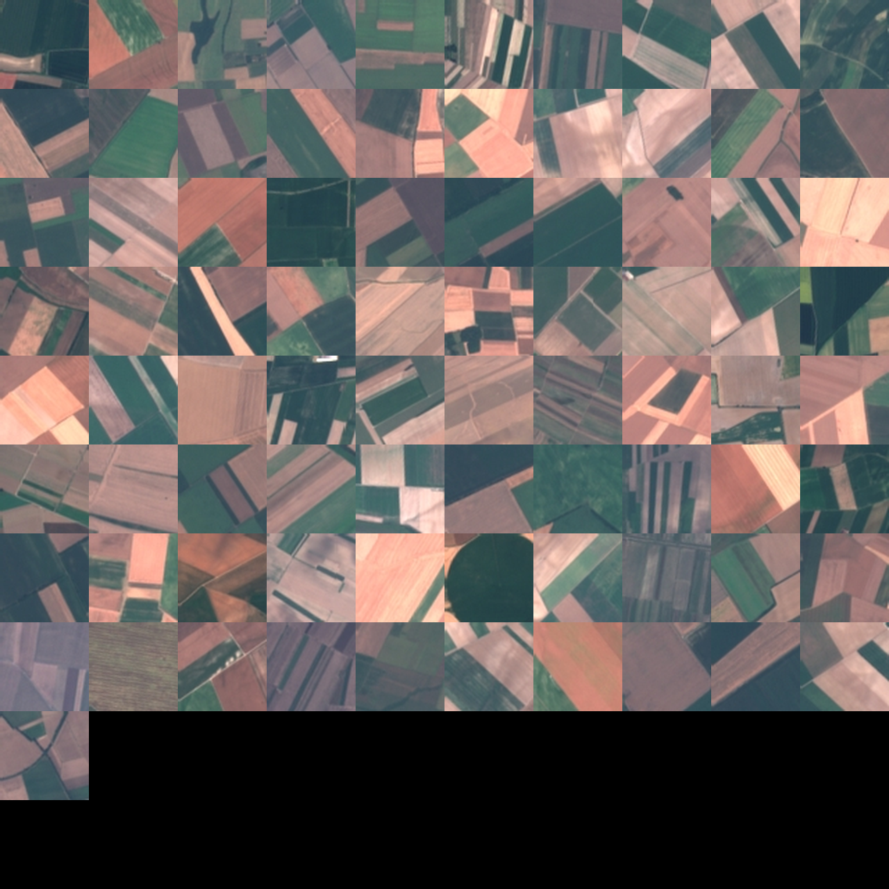
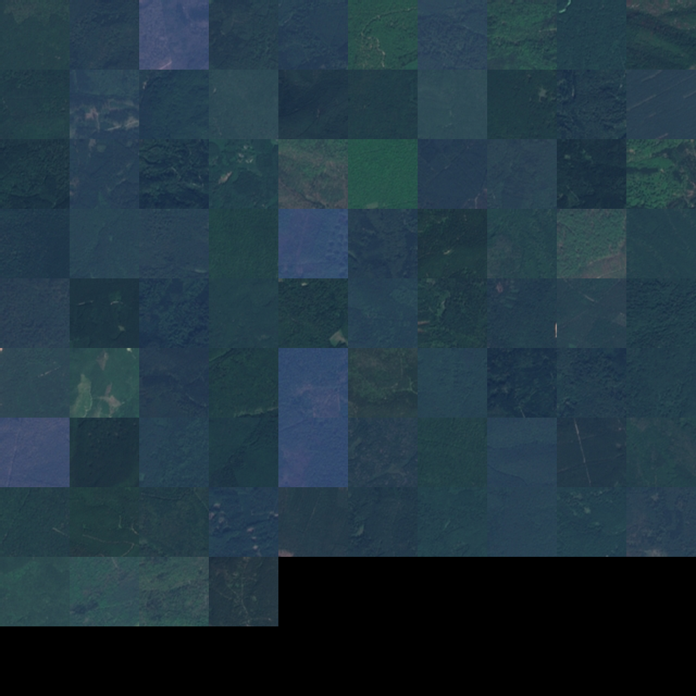
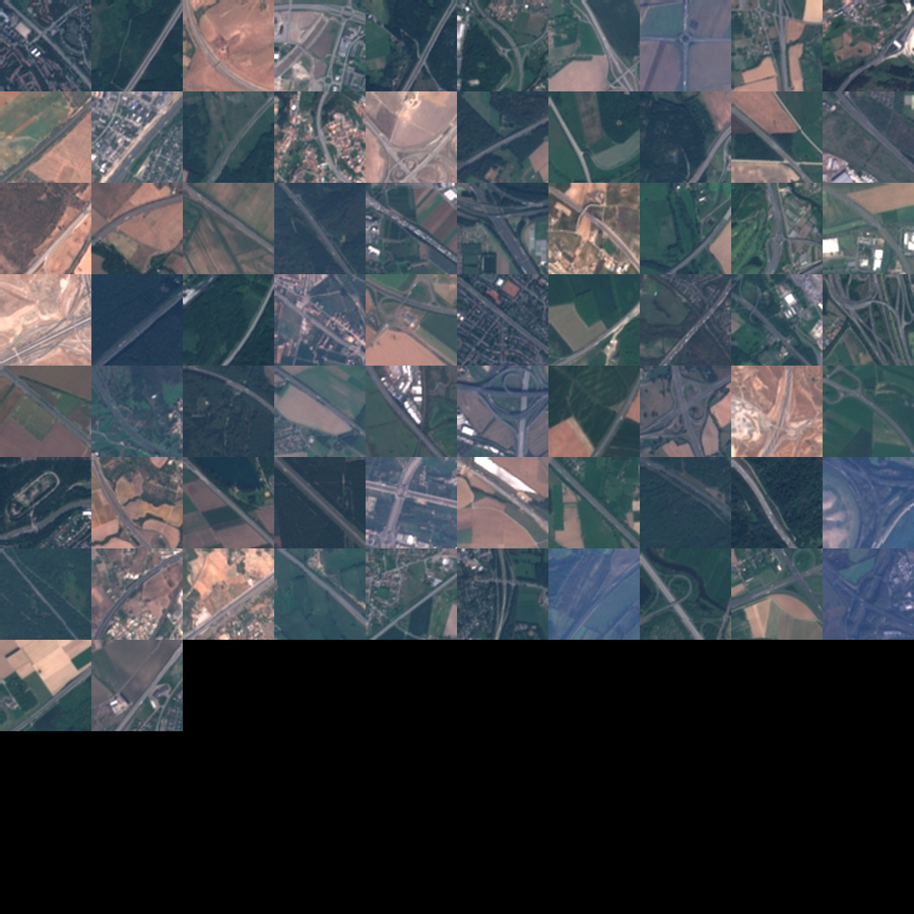

# CVDMS EuroSAT Single-Label Classifier

This project is a small baseline implementation showing how to train a PyTorch model from dataset artifacts produced by **CVDMS**.

It consumes a CVDMS dataset version from S3, including:

- `metadata.json`
- train/validation/test JSONL manifests
- S3 image references
- version-specific class mappings

The goal is not to build a complex model, but to demonstrate the basic path from a versioned CVDMS dataset into a reproducible PyTorch training workflow.

## Usage

First, inspect the dataset to ensure the CVDMS metadata, manifests, image loading, transforms, and DataLoaders are functioning properly:

```bash
python source/inspect_dataset.py --config config.yaml
```

Next, optionally generate image mosaics for visual inspection of the dataset:

```bash
python source/generate_mosaics.py --config config.yaml --rows 10 --cols 10 --tile-size 128
```

Finally, train the model as follows:

```bash
python source/train.py --config config.yaml
```

View logs in tensorboard by running the following:

```bash
tensorboard --logdir=outputs/tensorboard
```

## What this project demonstrates

This project trains a single-label image classifier using a pretrained ResNet18 model with staged transfer learning:

1. Train the classifier head only.
2. Unfreeze later backbone layers for light fine-tuning.
3. Unfreeze additional backbone layers for a final fine-tuning phase.

Each phase has its own configured learning rates, trainable layers, and maximum epoch count. Early stopping can shorten a phase, but the phase schedule remains explicit and controlled.

## Outputs

Training writes artifacts under `outputs/`, including:

- model checkpoints
- class map
- CVDMS training metadata
- model architecture summaries
- evaluation summary JSON
- TensorBoard logs

TensorBoard includes standard training diagnostics such as:

- train/validation loss
- train/validation accuracy
- train/validation precision, recall, and F1
- learning rates by parameter group
- trainable parameter counts
- validation confusion matrices
- one-vs-rest precision-recall curves

## Purpose

This project serves as a compact proof of concept for using CVDMS dataset outputs in a real PyTorch training workflow.

It is intended as a baseline example, not a final modeling benchmark. The main value is demonstrating that CVDMS can produce versioned dataset artifacts that are directly usable for downstream model training, evaluation, and experiment inspection.

## Mosaic Outputs - Better Dataset Understanding

Below is a collection of mosaic images from the testing split for 
this EuroSAT-based dataset. This helps us better understand what the images look like and 
how classes compare between splits of the dataset.

<p align="center">
  <br>
  <em>EuroSAT Annual Crops (test set, 81 samples).</em>
</p>

<p align="center">
  <br>
  <em>EuroSAT Forests (test set, 84 samples).</em>
</p>

<p align="center">
  <br>
  <em>EuroSAT Highways (test set, 72 samples).</em>
</p>